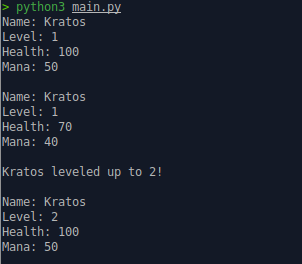

# Game Character Stats Tracker

A simple Python project that demonstrates Object-Oriented Programming (OOP) by building a game character system.

The program allows you to:

* Create game characters
* Manage health and mana
* Level up characters
* Display character stats

---

## Features

* Character creation
* Health management
* Mana management
* Character leveling system
* Property getters and setters
* Validation for health and mana limits
* Clean string representation of character stats

---

## Technologies Used

* Python3
* Object-Oriented Programming (OOP)

---

### Project Structure

```bash
> tree -v .
.
├── LICENSE
├── README.md
├── img
│   └── game_character_stats_tracker.png
└── main.py

1 directory, 4 files
```

---

### Example Output

```bash
Name: Kratos
Level: 1
Health: 100
Mana: 50

Name: Kratos
Level: 1
Health: 70
Mana: 40

Kratos leveled up to 2!

Name: Kratos
Level: 2
Health: 100
Mana: 50
```

---

### How to Run

#### Run the Program

```bash
python main.py
```

---

#### Concepts Practiced

* Classes and Objects
* Encapsulation
* Properties
* Getters and Setters
* Validation Logic
* String Formatting

---

##### Learning Goal

This project was built to strengthen Python and Backend Engineering skills through hands-on OOP practice.

---

##### Program Output Image



---
